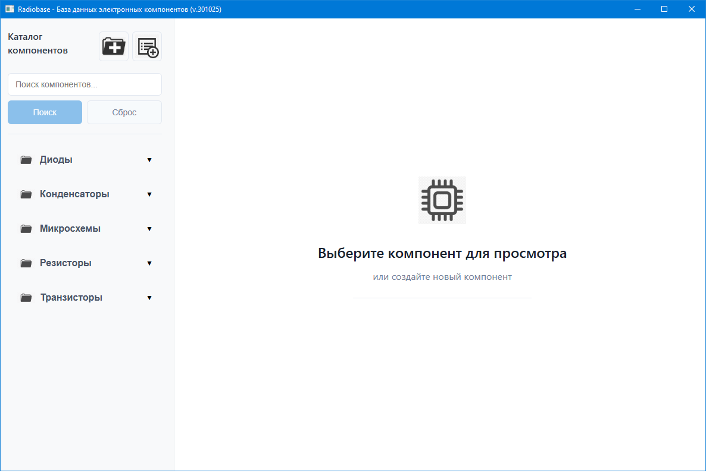
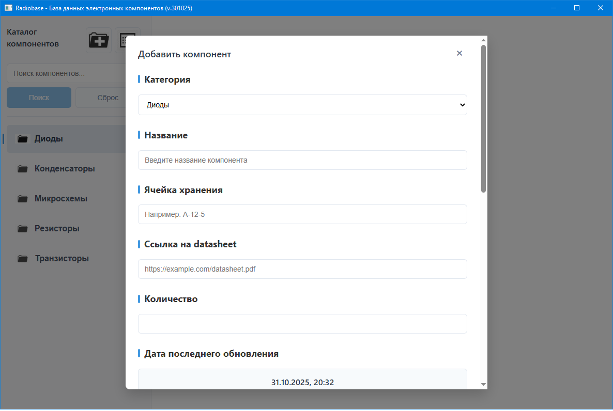
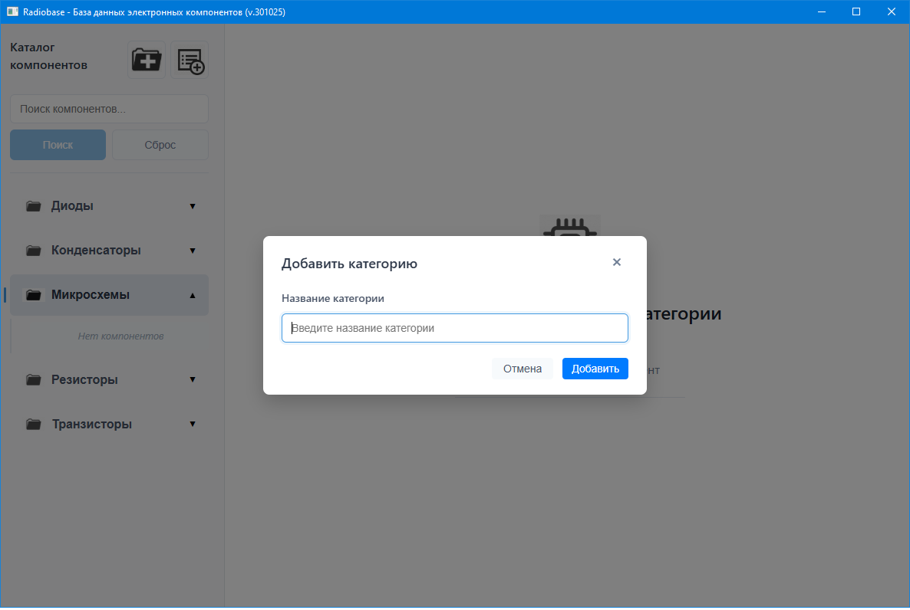
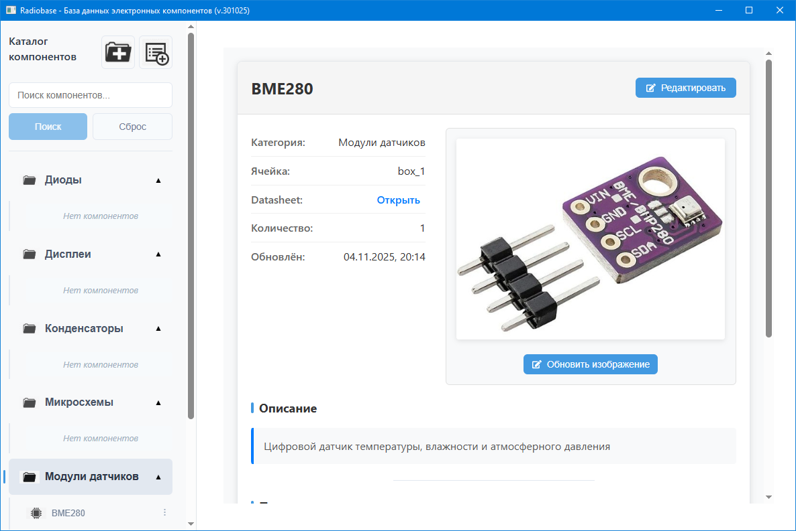
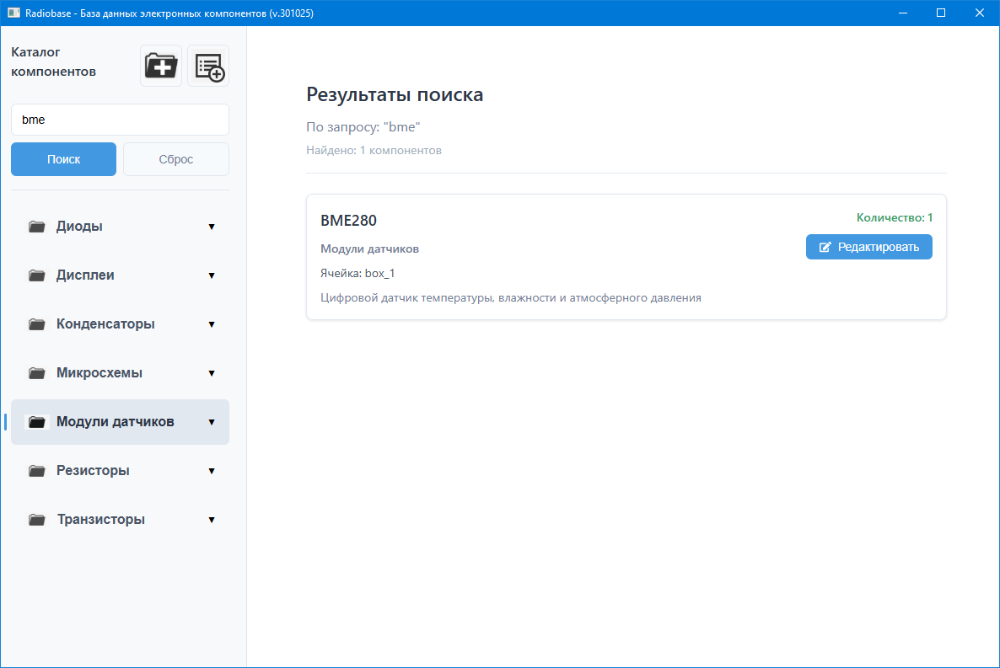

# Выпускная квалификационная работа (ВКР) на тему "Разработка учётной информационной системы для радиодеталей и электронных компонентов"
***

__Проект размещён в директории radiobase настоящего репозитория radiobase-diploma__


***

# Стек технологий
- Electron + React + Vite
- Javascript
- CSS
- SQL.js

***

# Запуск
- склонировать репозиторий
```
git clone git@github.com:VladyBarvy/radiobase-diploma.git
```
- перейти в директорию проекта
```
cd radiobase-diploma/radiobase
```
- установить зависимости
```
npm install
```
- запустить приложение
```
npm run dev
```
***


# Описание проекта
Десктоп-приложение "RadioBase" предназначено для учёта радиодеталей и электронных компонентов и формирования справочной информационной базы.
Оно представляет собой современный цифровой аналог картотеки радиодеталей, предназначенный для радиолюбителей, инженеров-электронщиков, преподавателей и студентов технических специальностей, сотрудников оффлайн-магазинов робототехники, а также всех, кто работает с электронными компонентами.
Приложение работает автономно, не требует подключения к интернету и предоставляет удобный интерфейс для систематизации всей информации о компонентах в одном месте.

## Ключевой функционал
  * Создание, редактирование и удаление категорий компонентов
  * Предустановленные категории: Транзисторы, Резисторы, Конденсаторы, Микросхемы, Диоды
  * Иерархическое отображение в виде раскрывающегося дерева в боковой панели


## Управление компонентами
1. Добавление новых компонентов с полной информацией:
  * Название компонента
  * Категория
  * Ячейка хранения (для быстрого поиска в физическом хранилище)
  * Количество на складе
  * Ссылка на datasheet (техническую документацию)
  * Текстовое описание
  * Изображение компонента
2. Редактирование существующих компонентов
3. Удаление компонентов
4. Контекстное меню для быстрых операций с компонентами


## 🔍 Поиск и фильтрация
1. Мгновенный поиск по всем полям компонентов:
  * Название
  * Описание
  * Ячейка хранения
  * Название категории
2. Отображение результатов поиска в отдельном интерфейсе
3. Быстрый доступ к найденным компонентам

## 🖼 Работа с изображениями
  * Загрузка изображений компонентов
  * Предпросмотр перед сохранением
  * Возможность обновления изображений
  * Отображение в карточке компонента

## 📄 Управление документацией
  * Хранение ссылок на datasheet (техническую документацию)
  * Встроенный браузер для просмотра документации прямо в приложении
  * Автоматическое открывание внешних ссылок в системном браузере


## 💾 База данных
  При первом запуске приложения база данных формируется отдельным внешним файлом radiodata.db в директории Database,
  которая автоматически создаётся в том же каталоге, где и располагается исполняемый файл RadioBase.exe приложения.
  Файл radiodata.db легко копировать, переносить и заменять на другой с иного компьютера.

***

# Интерфейс
  На левой панели расположено дерево категорий и компонентов, а также поиск и кнопки добавления новых категорий и компонентов.
  В основной части окна отображается детальная информация о выбранном компоненте, а также результаты поиска.
  Предусмотрен адаптивный дизайн с поддержкой разных разрешений экрана.

  Элементы управления включают в себя:
  * интуитивные модальные окна для добавления/редактирования
  * контекстные меню для быстрых действий
  * диалоги подтверждения для опасных операций (удаление)


### Стартовое окно приложения
<div align="center">

</div>

### Модальное окно добавления/редактирование карточки компонента
<div align="center">

</div>

### Модальное окно добавления новой категории компонентов
<div align="center">

</div>

### Карточка электронного компонента
<div align="center">

</div>

### Результаты поиска
<div align="center">

</div>
